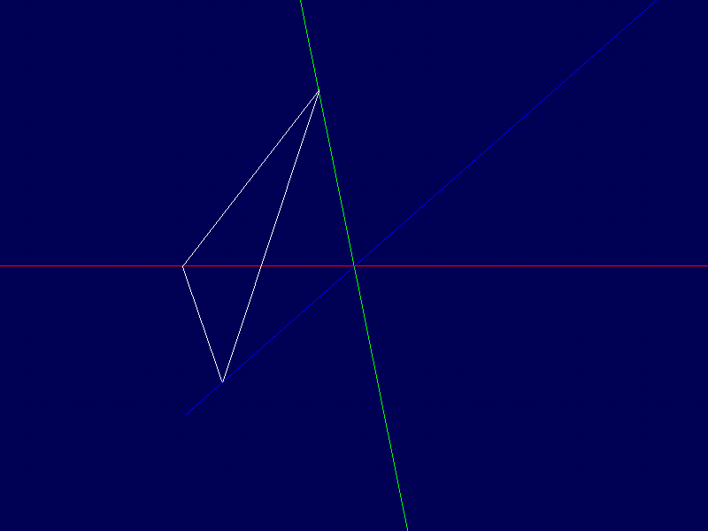

# Lucas in Calc III - A Calculus Engine written in pure C



## Run

To execute, simply 

```
gcc demo.c calc3.c -o demo -lm
```

Libraries can be included and imported in any fashion to your desire.

## Features
* Calculus III
  * Vectors
    * FullVectors (Vectors like AB or CD)
    * Cross Product
      * Matrixes
        * 2x2 Determinants
          * 3x3 Determinants
      * Area of 2D Shapes in 3D Space
        * Triangles
        * Parrallelorgrams
    * Dot Product
    * Function Parameterizations
      * Algebraic Syntax Notation Function
* Physics
  * Physics Object 
  * Force Vector
* 3D Display
  * Draw 3D Vectors to Display
  * GIF Generation of 3D Object

## Open Source Shoutouts

All of the libraries used are open source. They are mono files, meaning that beyond the standard C standard library,
it doesn't use any sort of external libraries to generate code. They're all linked in demo.c if you want a reference.

All of these libraries are open source. So is calciii.c, although I personally think people have better C libraries made for this type of thing

* Tsoding's Olive.c image generation library
  * https://github.com/tsoding/olive.c
* MSH_GIF, simple GIF library
  * https://github.com/notnullnotvoid/msf_gif/tree/master
* stb_image.h & stb_image_write.h, for writing PNGs from olive and the gif library
  * https://github.com/nothings/stb

While NOT an open source library, shoutout to tsoding's entire video explaining how to do 2D in 3D. Could not have
made this project as cool as I have without this:
https://www.youtube.com/watch?v=qjWkNZ0SXfo&t=394s


## Why?

I want to recreate Calc III so that I can visualize and work on it over the summer. This will allow me to do mathematical operations in
3D space. This **can** be used by you, too, but there's wayy better and smarter people who have made cooler things.

The library essentially is a buffet of useful data types and functions in Calc III. Pick and choose what you need for making
your simulation in demo.c, or in your own projects

## Approach
Using MONO C files for 100% 0 dependencies (except for c std but we all gotta lose sometimes) render vector math and calculations not really fast. All Calc III functions and object are made by yours truly, in a well (angrily?) commented response. The actual library is hella good, but demo.c, while it links the libraries, does things pretty slowly in the image generation. Still, hella cool.
