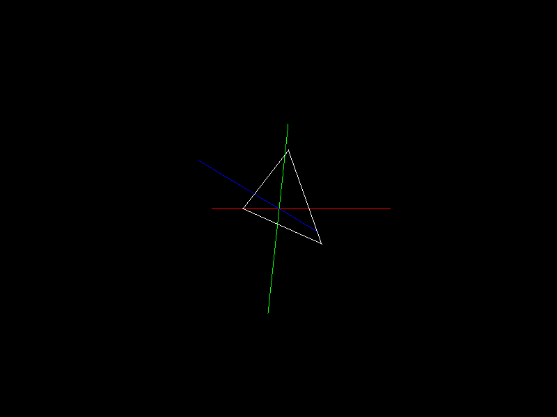

# Lucas in Calc III - A Calculus Engine written in pure C



## Run

To execute, simply 

```
gcc demo.c calc3.c -o demo -lm
```

Libraries can be included and imported in any fashion to your desire.

## Features
* Calculus III
  * Vectors
    * FullVectors (Vectors like AB or CD)
    * Cross Product
      * Matrixes
        * 2x2 Determinants
          * 3x3 Determinants
      * Area of 2D Shapes in 3D Space
        * Triangles
        * Parrallelorgrams
    * Dot Product
    * Function Parameterizations
      * Algebraic Syntax Notation Function
* Physics
  * Physics Object 
  * Force Vector
* 3D Display
  * Draw 3D Vectors to Display
  * GIF Generation of 3D Object

## Open Source Shoutouts

* Tsoding's


## Why?

I want to recreate Calc III so that I can visualize and work on it over the summer. This will allow me to do mathematical operations in
3D space. This **can** be used by you, too, but there's wayy better and smarter people who have made cooler things.

The library essentially is a buffet of useful data types and functions in Calc III. Pick and choose what you need for making
your simulation in demo.c, or in your own projects

## Approach
Using MONO C files for 100% 0 dependencies (except for c std but we all gotta lose sometimes) render vector math and calculations blazingally fast. All Calc III functions and object are made by yours truly, in a well (angrily?) commented response
